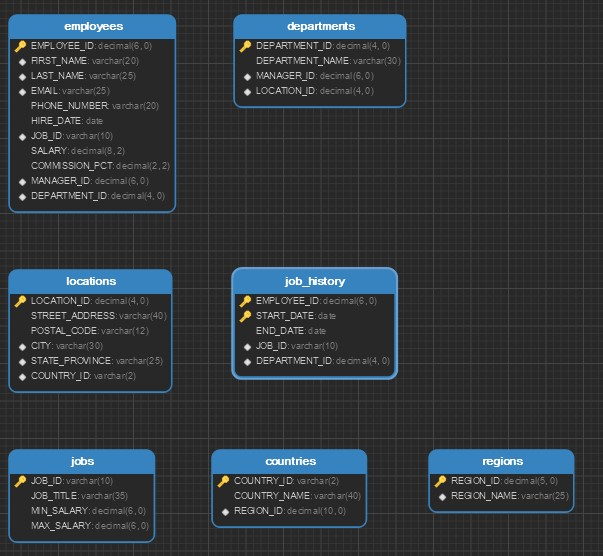

# Purwadhika_module_2

# Capstone Project - Module 2 - HR Database

# Data Source
https://drive.google.com/file/d/1XfhOHYKzW7Cz1RNHlknJI6Lz7LLSi5EI/view?usp=sharing

# General Question
1. Data karyawan pada suatu perusahaan yang bekerja sampai saat ini di beberapa departemen yang tersebar pada beberapa lokasi di berbagai negara
2. Data perolehan komisi tiap karyawan dan department 
3. Ada 7 Table yang disediakan pada database HR, berikut tampilan ERD nya
  

 
 ## Detail data employees

Data ini berisikan dari gabungan 5 tabel dan 1 CTE Function, kelima tabel tersebut ialah ```employees```, ```jobs```, ```departments```, ```locations```, ```countries```
Informasi diantara lain ialah :
- ID dari tabel employees
- Fullname menggunakan fungsi CTE
- Department dari tabel departments
- Country dari tabel countries
- City dari tabel location
- Job Title dari tabel jobs
- Hired Date dari tabel employees
- Salary dari tabel employees

Juga terdapat kolom Commission yang merupakan hasil dari perkalian antara Salary dan Commision_PCT
Semua informasi tersebut kemudian dijadikan dalam sebuah DataFrame yang nantinya akan diolah informasinya.
